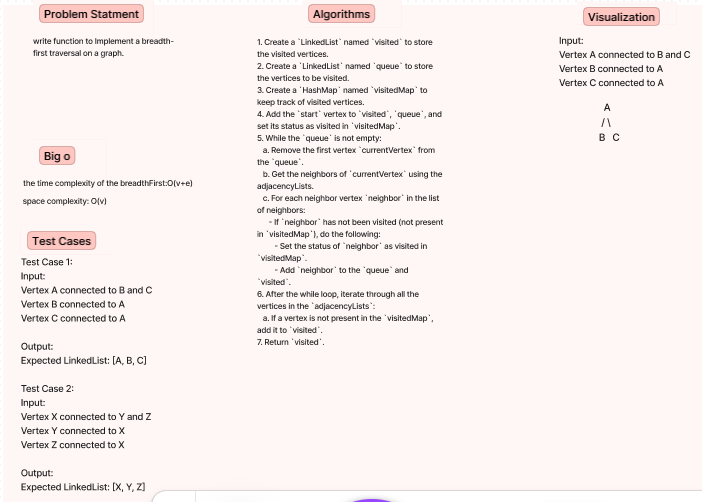
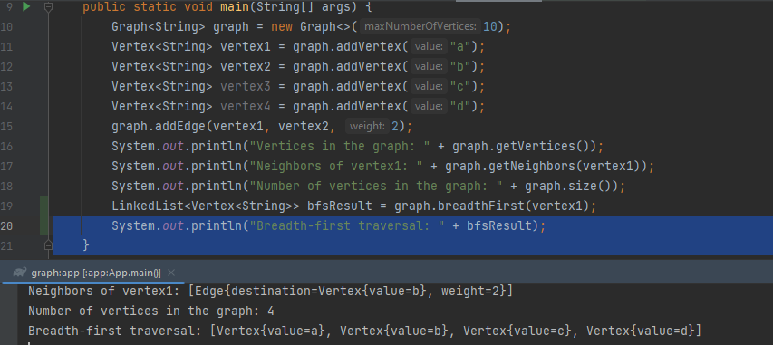

# Challenge Title:  breadth-first traversal on a graph.
<!-- Description of the challenge -->
## Whiteboard Process
<!-- Embedded whiteboard image -->

## Approach & Efficiency
<!-- What approach did you take? Why? What is the Big O space/time for this approach? -->
The approach taken in the code provided is a straightforward implementation of the breadth-first search algorithm.
Time complexity: O(V + E).
Space complexity: O(V).
## Solution
<!-- Show how to run your code, and examples of it in action -->

