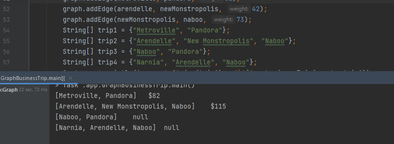

# Challenge Title:  Class 37
<!-- Description of the challenge -->
The challenge is to calculate the cost of a business trip based on a given graph and an array of city names.
## Whiteboard Process
<!-- Embedded whiteboard image -->

## Approach & Efficiency
<!-- What approach did you take? Why? What is the Big O space/time for this approach? -->
The approach in this code is to calculate the cost of a business trip in a graph.
The time complexity of this approach is O(n).
The space complexity is O(1).
## Solution
<!-- Show how to run your code, and examples of it in action -->

