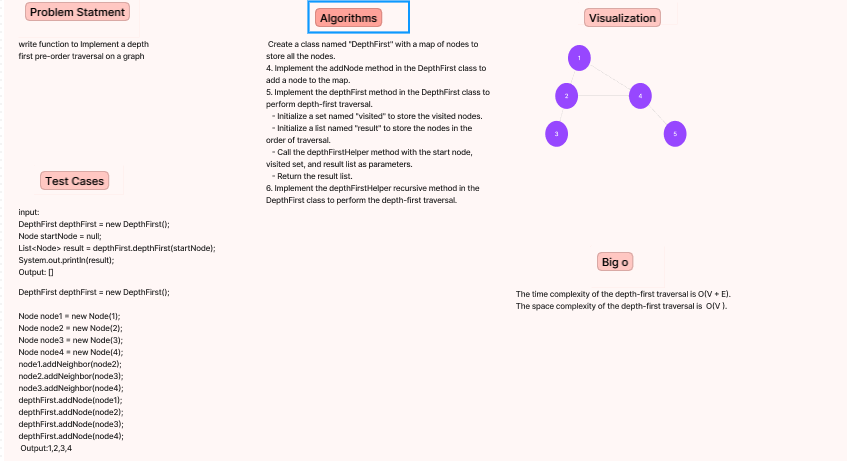
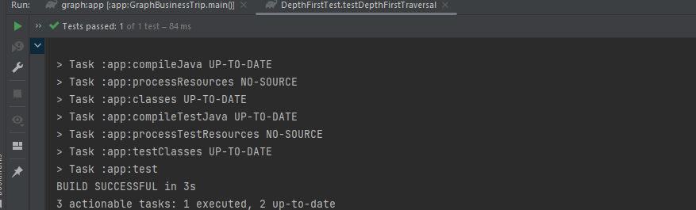

# Challenge Title:  Class 38
<!-- Description of the challenge -->
write function to Implement a depth first pre-order traversal on a graph
## Whiteboard Process
<!-- Embedded whiteboard image -->

## Approach & Efficiency
<!-- What approach did you take? Why? What is the Big O space/time for this approach? -->
The depthFirst method initiates a recursive helper method, depthFirstHelper, to perform the traversal. It keeps track of visited nodes using a Set data structure and adds visited nodes to a result list. It then recursively visits each neighbor of the current node.

The time complexity of this approach is O(V + E).
The space complexity is O(V).
## Solution
<!-- Show how to run your code, and examples of it in action -->

