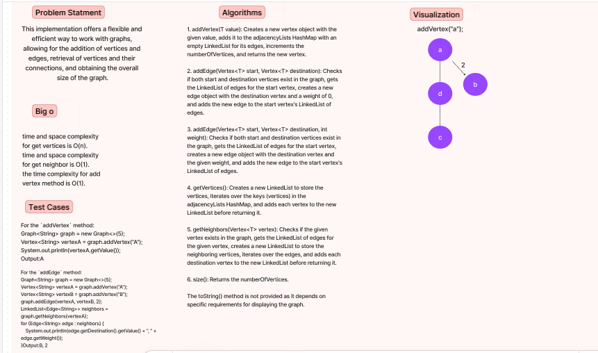
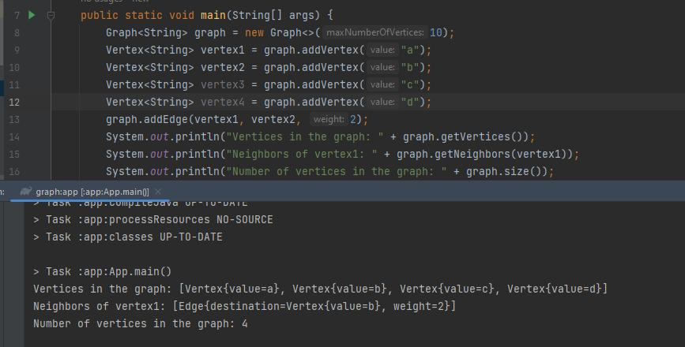
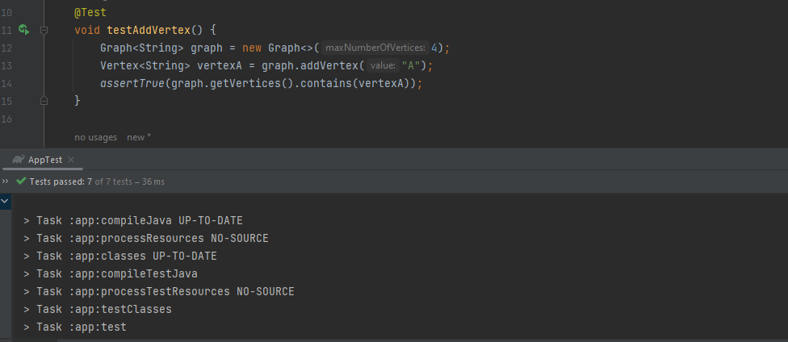

# Challenge Title: Graph
<!-- Description of the challenge -->
This implementation offers a flexible and efficient way to work with graphs, allowing for the addition of vertices and edges, retrieval of vertices and their connections, and obtaining the overall size of the graph.
## Whiteboard Process
<!-- Embedded whiteboard image -->

## Approach & Efficiency
<!-- What approach did you take? Why? What is the Big O space/time for this approach? -->
The approach taken for this Graph implementation is to use an adjacency list to represent the graph. The graph is represented as a HashMap, where each key-value pair represents a vertex and its corresponding list of edges.

The time complexity for adding a vertex is O(1) since it simply involves adding a key-value pair to the HashMap.

The time complexity for adding an edge is also O(1).
The time complexity for getting the vertices is O(1) .

The time complexity for getting the neighbors of a vertex is O(1).

The time complexity for the size method is O(1).
## Solution
<!-- Show how to run your code, and examples of it in action -->

