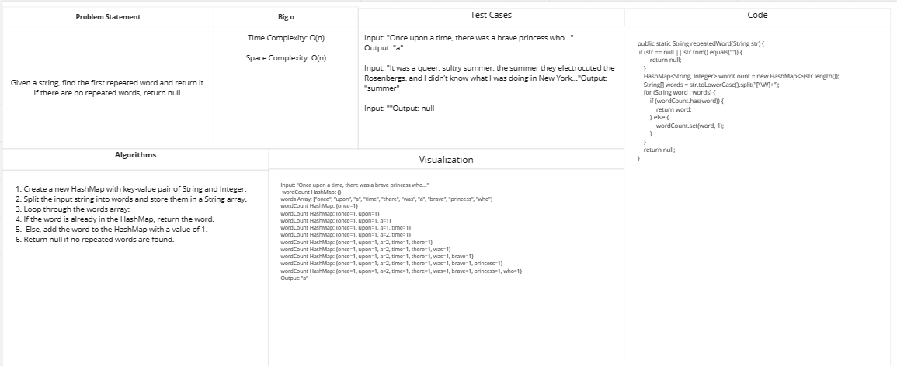
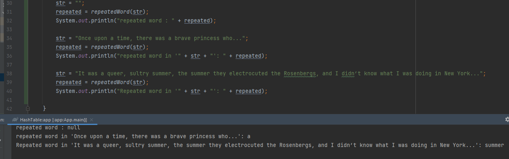
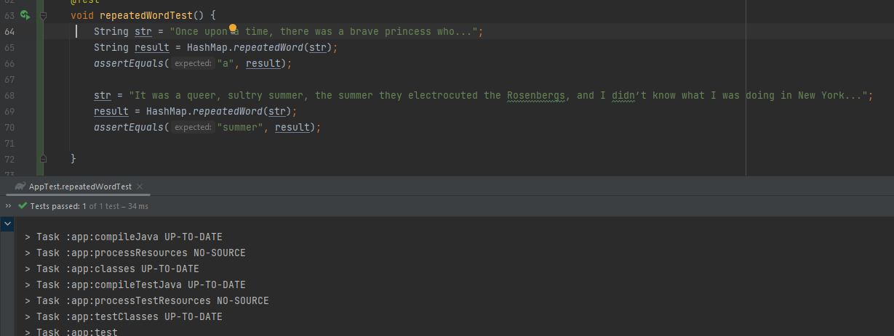

# Challenge Title:Find the first repeated word in a book.
<!-- Description of the challenge -->
This Function is to find the first repeated word and return it. If there are no repeated words, return null.
## Whiteboard Process
<!-- Embedded whiteboard image -->

## Approach & Efficiency
<!-- What approach did you take? Why? What is the Big O space/time for this approach? -->
The approach used in the function is to first check if the input string is null or empty. If it's not, it creates a HashMap to store each word and its count. Then, it splits the input string into words, and loops through each word. For each word, it checks if it's already in the HashMap. If it is, it returns the word. If not, it adds the word to the HashMap with a count of 1. If no repeated word is found, it returns null.
## Solution
<!-- Show how to run your code, and examples of it in action -->

