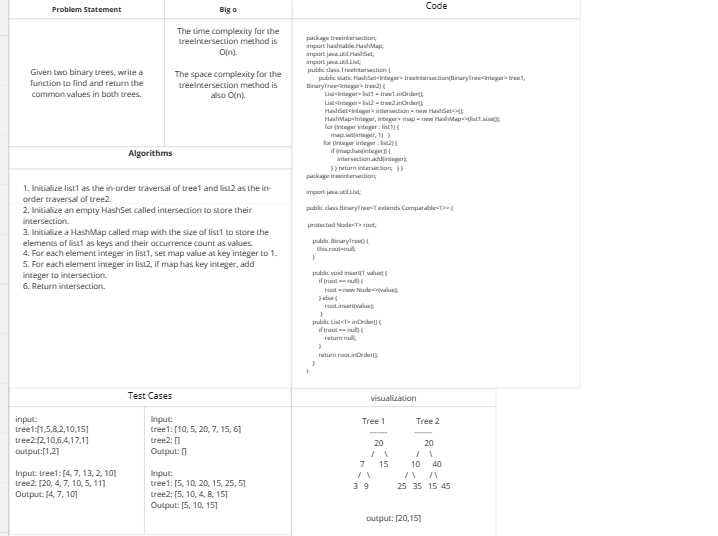
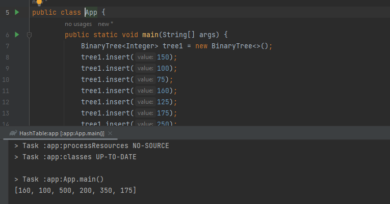
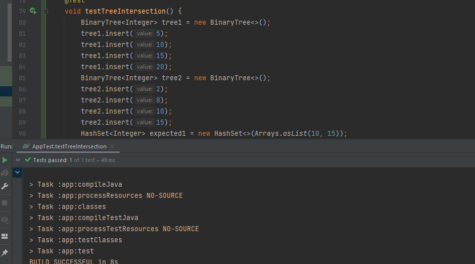

# Challenge Title:Find the first repeated word in a book.
<!-- Description of the challenge -->
Write a function that takes two binary trees and return a set of values found in both trees.
## Whiteboard Process
<!-- Embedded whiteboard image -->

## Approach & Efficiency
<!-- What approach did you take? Why? What is the Big O space/time for this approach? -->
The approach used is to first traverse both trees in order to generate two sorted lists of nodes, and then use a hash table to find the common nodes.
## Solution
<!-- Show how to run your code, and examples of it in action -->

