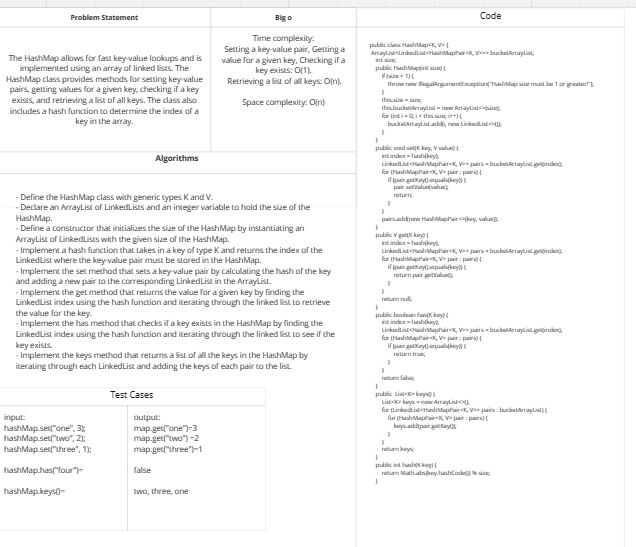

# Challenge Title
<!-- Description of the challenge -->
The implemented Hashtable class provides a way to store and retrieve key-value pairs.
The set() method takes a key-value pair, hashes the key to determine its index within the table, and sets the key-value pair in the table.
The get() method takes a key and returns the value associated with that key in the table.
The has() method takes a key and checks if it already exists in the table. It returns a boolean indicating whether the key exists or not.
The keys() method returns a collection of all keys in the table.
The hash() method takes a key and returns its index within the table.
## Whiteboard Process
<!-- Embedded whiteboard image -->

## Approach & Efficiency
<!-- What approach did you take? Why? What is the Big O space/time for this approach? -->
- The implemented hash map to handle hash collisions. It uses an ArrayList of LinkedList to store the key-value pairs where each index of the ArrayList corresponds to a specific hash bucket.
### Big o
* Time complexity:
Setting a key-value pair, Getting a value for a given key, Checking if a key exists: O(1).
Retrieving a list of all keys: O(n).
* Space complexity: O(n)
## Solution
<!-- Show how to run your code, and examples of it in action -->

