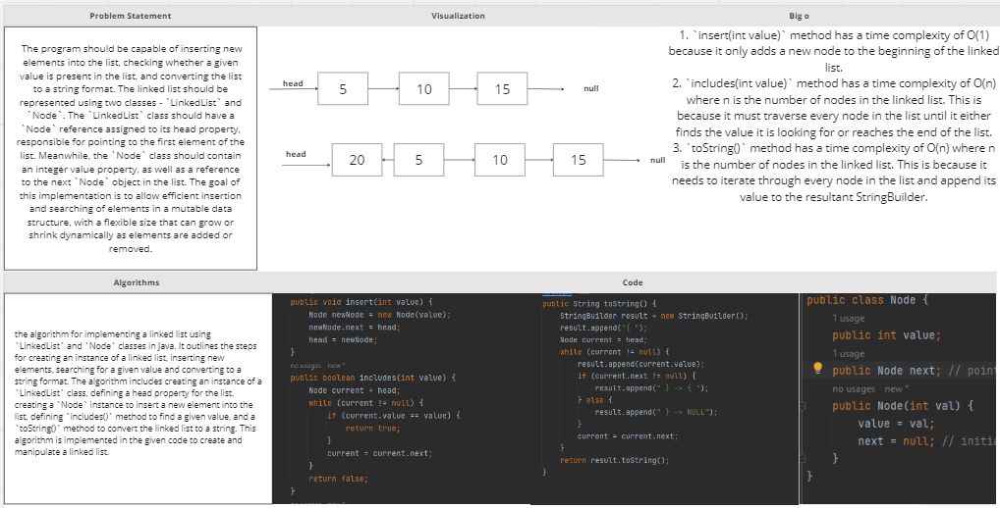

# Challenge Title: Class 05: Linked List Implementation

## Whiteboard Process
<!-- Embedded whiteboard image -->

## Approach & Efficiency
<!-- What approach did you take? Why? What is the Big O space/time for this approach? -->
The approach followed in the given code is that it uses the LinkedList and Node classes to create a singly linked list. The LinkedList class has methods for inserting an element, searching for a given value, and converting the list to a string format. The Node class helps in creating nodes that store the value of the element and a pointer to the next node in the list.

The insert method adds a new node to the beginning of the linked list. The includes method traverses the linked list until it finds the desired value or reaches the end of the list, and returns true or false depending on whether the element is found or not. The toString method converts the linked list into a string format that shows each element and the pointer that links them together.

The time complexity of the insert method is O(1) as it adds a new node to the beginning of the list, which takes constant time. The time complexity of the includes and toString methods is O(n), where n is the size of the linked list as both of them must traverse every node in the list. Therefore, the overall time complexity of the given code is O(n) where n is the number of nodes in the linked list.
## Solution
<!-- Show how to run your code, and examples of it in action -->

