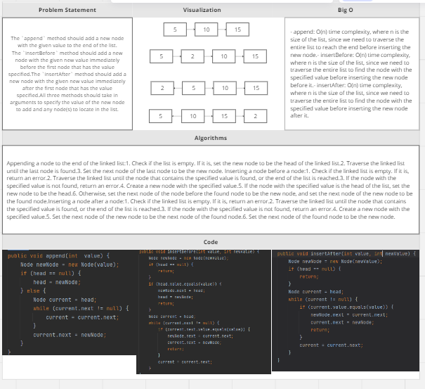
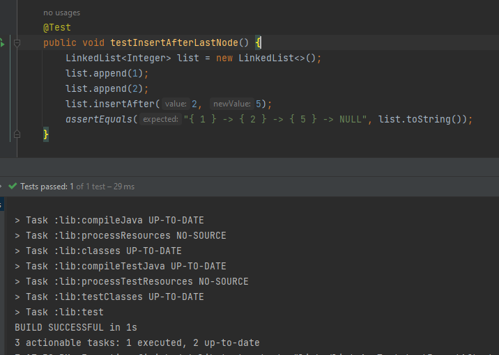

# Challenge Title : Code Challenge: Class 06
<!-- Description of the challenge -->

## Whiteboard Process
<!-- Embedded whiteboard image -->

## Approach & Efficiency
<!-- What approach did you take? Why? What is the Big O space/time for this approach? -->
For the append method, the approach taken is to traverse the linked list until the end is reached, and to then create a new node with the given value and link it to the last node in the list.

For the insertBefore method, the approach taken is to traverse the linked list until the first node with the given value is found, or until the end of the list is reached. If no matching node is found, an error is thrown. If a matching node is found, a new node is created with the given new value and linked to the node before the matching node.

For the insertAfter method, the approach taken is similar to insertBefore, except that the new node is linked to the node after the matching node, rather than before.

The time complexity of the append, insertBefore, and insertAfter methods is O(n), where n is the length of the linked list. This is because the methods each require a traversal of the list to find the insertion point. The space complexity for each method is O(1) since we are only creating a single new node at a time.
## Solution
<!-- Show how to run your code, and examples of it in action -->

<pre> public void append(int  value) {
        Node newNode = new Node(value);
        if (head == null) {
            head = newNode;
        } else {
            Node current = head;
            while (current.next != null) {
                current = current.next;
            }
            current.next = newNode;
        }
    }
    public void insertBefore(int value, int newValue) {
        Node newNode = new Node(newValue);
        if (head == null) {
            return;
        }
        if (head.value.equals(value)) {
            newNode.next = head;
            head = newNode;
            return;
        }
        Node current = head;
        while (current.next != null) {
            if (current.next.value.equals(value)) {
                newNode.next = current.next;
                current.next = newNode;
                return;
            }
            current = current.next;
        }
    }
    public void insertAfter(int value, int newValue) {
        Node newNode = new Node(newValue);
        if (head == null) {
            return;
        }
        Node current = head;
        while (current != null) {
            if (current.value.equals(value)) {
                newNode.next = current.next;
                current.next = newNode;
                return;
            }
            current = current.next;
        }
    }
}</pre>
