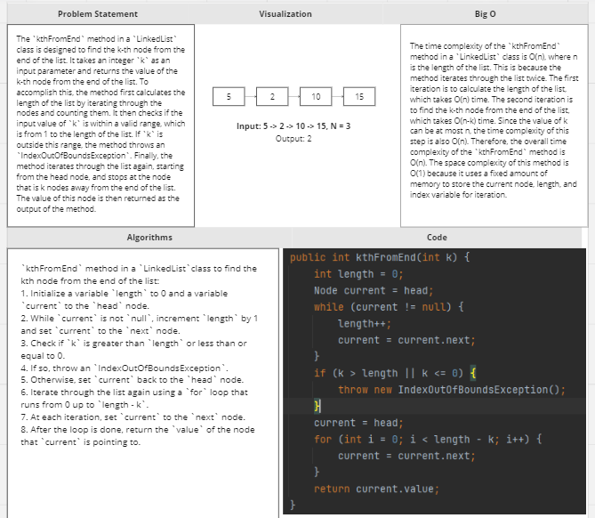

# Challenge Title: Code Challenge: Class 07
<!-- Description of the challenge -->

## Whiteboard Process
<!-- Embedded whiteboard image -->

## Approach & Efficiency
<!-- What approach did you take? Why? What is the Big O space/time for this approach? -->
Approach:
- Traverse the entire linked list to calculate the length of the list.
- Check if the given value of k is within the valid range (greater than 0 and less than or equal to the length of the list)
- Traverse the linked list again starting from the head node to find the k-th node from the end of the list. This can be done by traversing length-k nodes from the head node.

Efficiency:
- Time complexity: O(n), where n is the length of the linked list. This is because the method iterates through the list twice. The first iteration takes O(n) time to calculate the length of the list, while the second iteration takes O(n-k) time to find the kth node from the end.
- Space complexity: O(1), as the method uses a fixed amount of memory to maintain `length`, `current`, and `i`.

## Solution
<!-- Show how to run your code, and examples of it in action -->
<pre>public int kthFromEnd(int k) {
        int length = 0;
        Node current = head;
        while (current != null) {
            length++;
            current = current.next;
        }
        if (k > length || k <= 0) {
            throw new IndexOutOfBoundsException();
        }
        current = head;
        for (int i = 0; i < length - k; i++) {
            current = current.next;
        }
        return current.value;
    }</pre>
