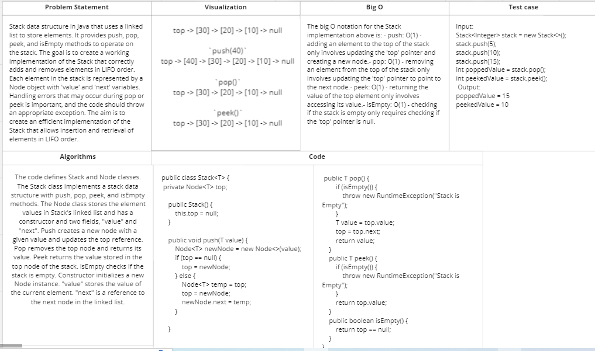
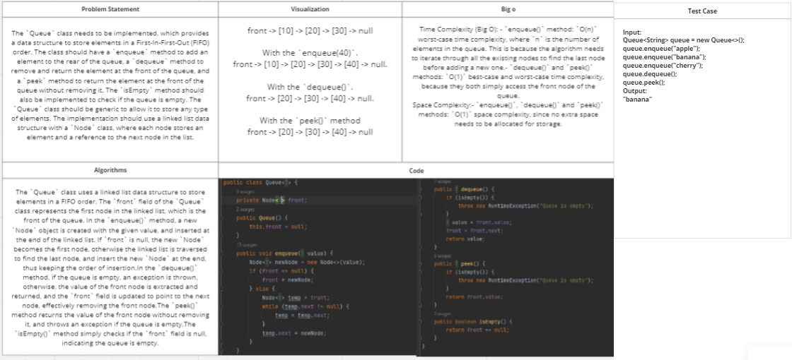

# Challenge Title: Stacks and Queues
<!-- Description of the challenge -->

## Whiteboard Process
<!-- Embedded whiteboard image -->
### Stack:

### Queue

## Approach & Efficiency
<!-- What approach did you take? Why? What is the Big O space/time for this approach? -->
For both `Stack` and `Queue` implementations, a linked list data structure is used to store elements. This approach allows for O(1) time complexity for adding or removing elements (push, pop, enqueue, dequeue, and peek), as these operations only require updating the pointers of the nodes that make up the linked list.

The `push` method for the `Stack` implementation is O(1) time complexity, since it only requires adding a new node at the top of the stack.

The `enqueue` method for the `Queue` implementation is O(n) worst-case time complexity, where n is the number of elements in the queue. This is because the `Queue` implementation uses a singly linked list, and in the worst case scenario, the linked list needs to be traversed to the end to add a new element.

Both the `pop` and `peek` methods for the `Stack` implementation and the `dequeue` and `peek` methods for the `Queue` implementation have a O(1) time complexity, since they only require accessing the top or front node of the list, respectively.

The `isEmpty` method for both implementations is O(1) time complexity, as it only checks if a single variable (the `top` or `front` variable) is null.

Overall, the implementation of both `Stack` and `Queue` data structures have an efficient method to add and remove the elements from their respective data structures. Therefore, the time complexity of the certain functions implemented should be sufficient for overall usage.
## Solution
<!-- Show how to run your code, and examples of it in action -->

