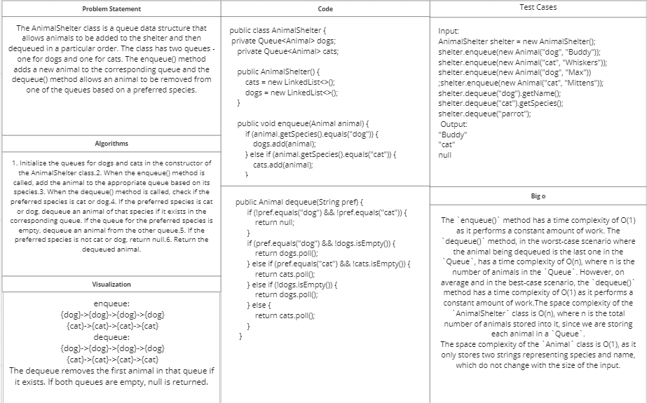

# Challenge Title:Animal Shelter.
<!-- Description of the challenge -->

## Whiteboard Process
<!-- Embedded whiteboard image -->

## Approach & Efficiency
<!-- What approach did you take? Why? What is the Big O space/time for this approach? -->
The implementation of AnimalShelter class uses two queues to store animals based on their species. For enqueueing, the method simply adds to the appropriate queue. For dequeueing, the method checks if the preferred species is cat or dog and removes the animal from the corresponding queue. If the queue for the preferred species is empty, it removes the animal from the other queue. The dequeue() method returns the dequeued animal or null if no matching animal is present.

## Solution
<!-- Show how to run your code, and examples of it in action -->
package queue;

import java.util.LinkedList;
import java.util.Queue;

import animalshelter.Animal;

public class AnimalShelter {
private Queue<Animal> dogs;
private Queue<Animal> cats;

    public AnimalShelter() {
        cats = new LinkedList<>();
        dogs = new LinkedList<>();
    }

    public void enqueue(Animal animal) {
        if (animal.getSpecies().equals("dog")) {
            dogs.add(animal);
        } else if (animal.getSpecies().equals("cat")) {
            cats.add(animal);
        }
    }

    public Animal dequeue(String pref) {
        if (!pref.equals("dog") && !pref.equals("cat")) {
            return null;
        }
        if (pref.equals("dog") && !dogs.isEmpty()) {
            return dogs.poll();
        } else if (pref.equals("cat") && !cats.isEmpty()) {
            return cats.poll();
        } else if (!dogs.isEmpty()) {
            return dogs.poll();
        } else {
            return cats.poll();
        }
    }

