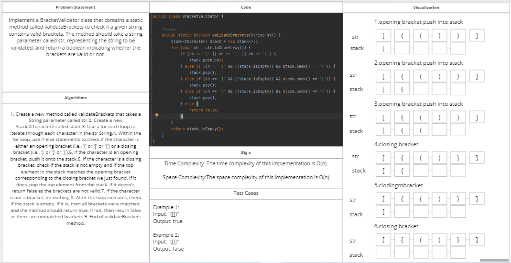
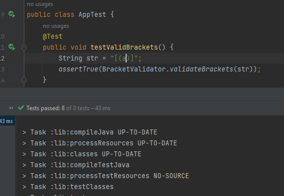

# Challenge Title: Multi-bracket Validation.
<!-- Description of the challenge -->

## Whiteboard Process
<!-- Embedded whiteboard image -->

## Approach & Efficiency
<!-- What approach did you take? Why? What is the Big O space/time for this approach? -->
The approach taken is to use a stack data structure to keep track of opening brackets and check if closing brackets match the last opening bracket pushed into the stack. The method loops through each character in the string input, and performs the necessary actions depending on whether an opening or closing bracket is found.

The time complexity of this algorithm is O(n)
## Solution
<!-- Show how to run your code, and examples of it in action -->
Code:
```
    public static boolean validateBrackets(String s) {
        Stack<Character> stack = new Stack<>();
        for (char c : s.toCharArray()) {
            if (c == '(' || c == '[' || c == '{') {
                stack.push(c);
            } else if (c == ')' || c == ']' || c == '}') {
                if (stack.isEmpty()) {
                    return false;
                }
                char last = stack.pop();
                if ((c == ')' && last != '(') || (c == ']' && last != '[') || (c == '}' && last != '{')) {
                    return false;
                }
            }
        }
        return stack.isEmpty();
    }              
```         
 Test:    
