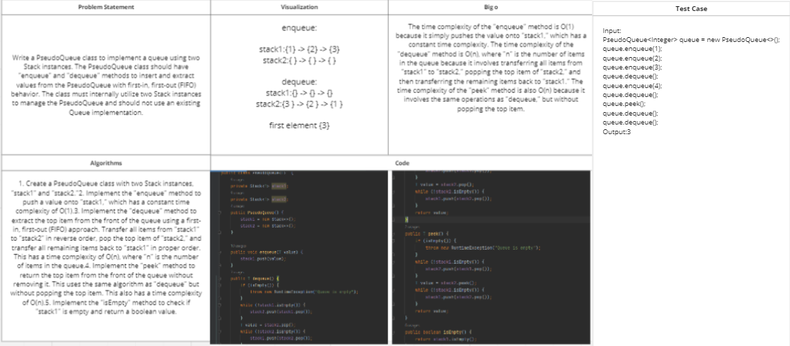
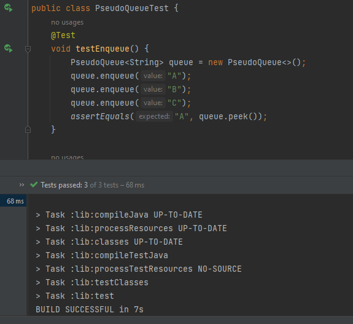

# Challenge Title:Lab11
<!-- Description of the challenge -->

## Whiteboard Process
<!-- Embedded whiteboard image -->

## Approach & Efficiency
<!-- What approach did you take? Why? What is the Big O space/time for this approach? -->
The PseudoQueue class uses two stacks to simulate a queue, with enqueue() adding items to stack1 and dequeue() and peek() "popping" items from stack2 after it has been filled by reversing the order of stack1. The time complexity for enqueue() is O(1) and for dequeue() and peek() is O(n) in the worst-case scenario. The amortized time complexity for dequeue() and peek() is O(1) on average. The time complexity for isEmpty() is O(1). The space complexity for the PseudoQueue class is O(n) due to the two stacks, which have a maximum size of n.
## Solution
<!-- Show how to run your code, and examples of it in action -->
    package queue;
    
    import stack.Stack;
    
    
    public class PseudoQueue<T>  {
    private Stack<T> stack1;
    private Stack<T> stack2;
    public PseudoQueue() {
    stack1 = new Stack<>();
    stack2 = new Stack<>();
    }

    public void enqueue(T value) {
        stack1.push(value);
    }
    public T dequeue() {
        if (isEmpty()) {
            throw new RuntimeException("Queue is empty");
        }
        while (!stack1.isEmpty()) {
            stack2.push(stack1.pop());
        }
        T value = stack2.pop();
        while (!stack2.isEmpty()) {
            stack1.push(stack2.pop());
        }
        return value;
    }
    public T peek() {
        if (isEmpty()) {
            throw new RuntimeException("Queue is empty");
        }
        while (!stack1.isEmpty()) {
            stack2.push(stack1.pop());
        }
        T value = stack2.peek();
        while (!stack2.isEmpty()) {
            stack1.push(stack2.pop());
        }
        return value;
    }
    public boolean isEmpty() {
        return stack1.isEmpty();
    }}

