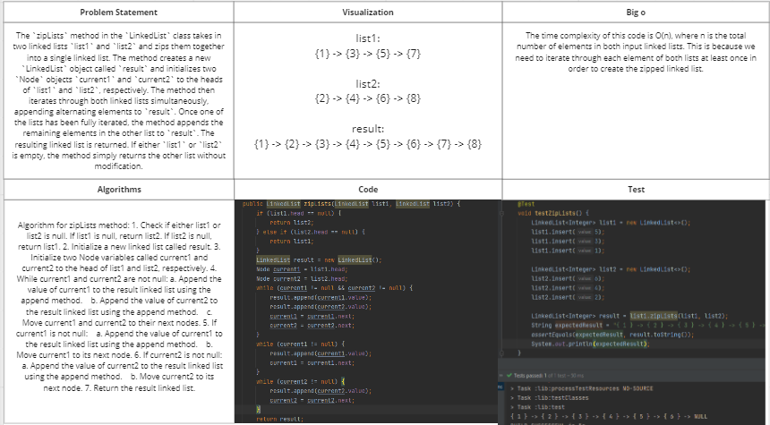
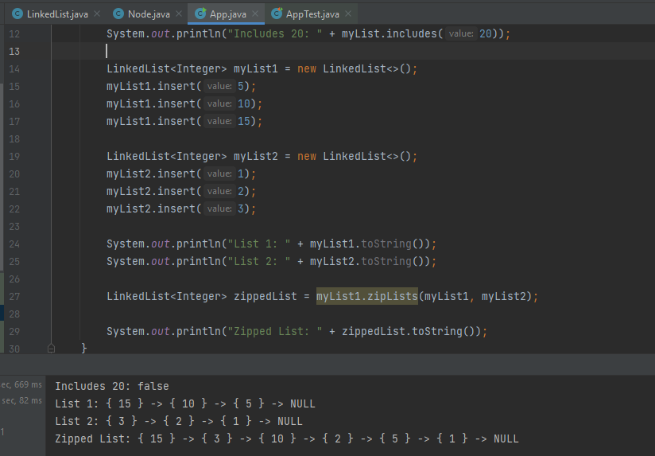

# Challenge Title: Code Challenge: Class 08
<!-- Description of the challenge -->

## Whiteboard Process
<!-- Embedded whiteboard image -->

## Approach & Efficiency
<!-- What approach did you take? Why? What is the Big O space/time for this approach? -->
The implementation creates a new linked list with alternating elements from both input lists. Any remaining elements from the input lists are appended to the end of the result list. The time and space complexity of this implementation is O(n), where n is the total number of elements in both input lists. Overall, it is a straightforward and efficient approach that involves iterating through both input lists and appending elements to the result list.
## Solution
<!-- Show how to run your code, and examples of it in action -->
