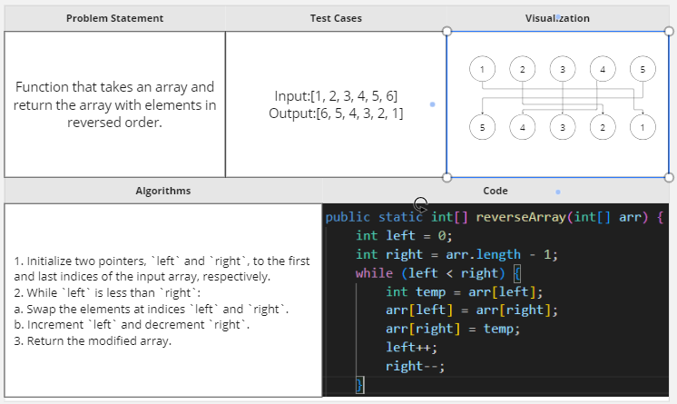

# data-structures-and-algorithms

# Challenge Title
<!-- Description of the challenge -->

## Whiteboard Process

## Approach & Efficiency
The time complexity of this approach is O(n/2) or O(n), where n is the length of the input array. This is because the loop iterates through the array until the middle is reached

## Solution
<!-- Show how to run your code, and examples of it in action -->