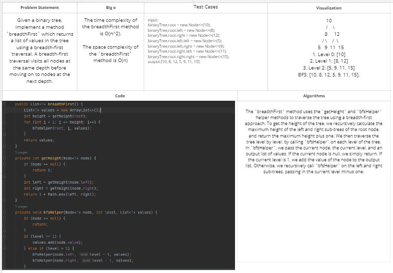
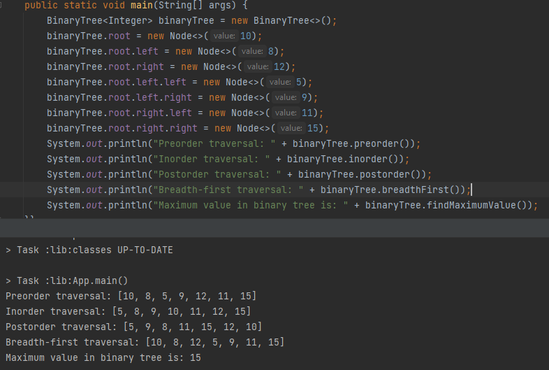
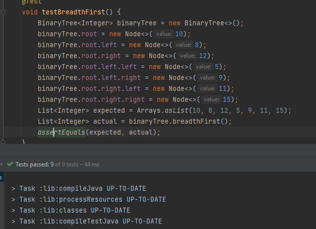

# Challenge Title:Breadth-first Traversal.
<!-- Description of the challenge -->

## Whiteboard Process
<!-- Embedded whiteboard image -->

## Approach & Efficiency
<!-- What approach did you take? Why? What is the Big O space/time for this approach? -->
The given implementation uses a breadth-first traversal to visit each node in the binary tree exactly once, and add its value to an output list. We calculate the height of the tree first, and then iterate over each level of the tree using a helper method `bfsHelper`, which recursively adds the values of nodes at the current level to the output list.

## Solution
<!-- Show how to run your code, and examples of it in action -->

