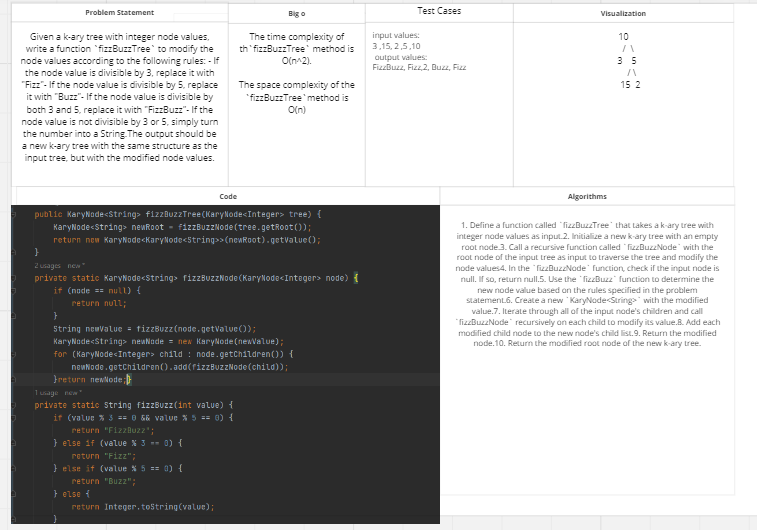

# Challenge Title: FizzBuzz
<!-- Description of the challenge -->

## Whiteboard Process
<!-- Embedded whiteboard image -->

## Approach & Efficiency
<!-- What approach did you take? Why? What is the Big O space/time for this approach? -->
This solution uses recursive approach to traverse through a k-ary tree and apply the given rules to change node values to "Fizz", "Buzz", "FizzBuzz" or string representation of node value. The function `fizzBuzzTree()` creates a new k-ary tree with modified node values and returns it. It uses a helper function `fizzBuzzNode()` which is called recursively to traverse each node and modify its value.
## Solution
<!-- Show how to run your code, and examples of it in action -->
