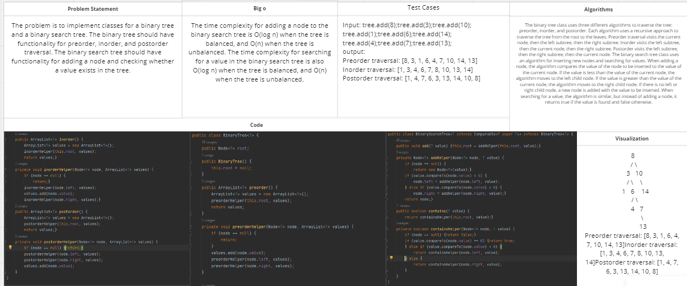
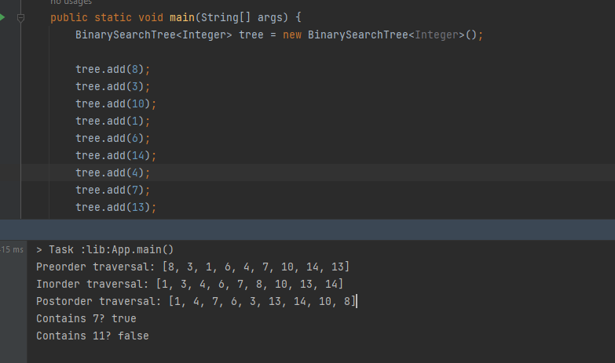
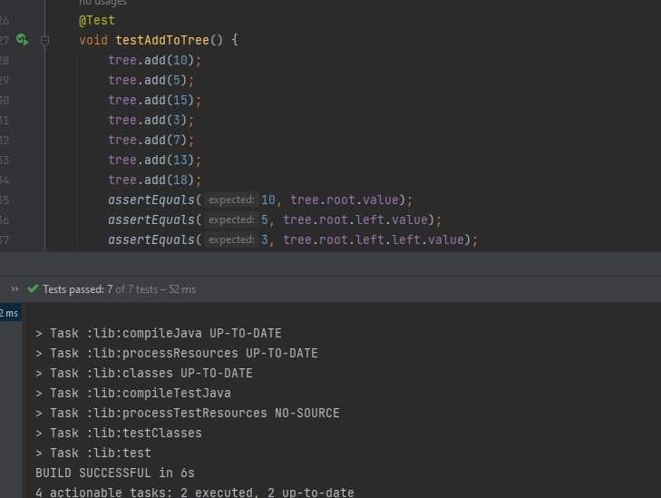

# Challenge Title:Trees
<!-- Description of the challenge -->

## Whiteboard Process
<!-- Embedded whiteboard image -->

## Approach & Efficiency
<!-- What approach did you take? Why? What is the Big O space/time for this approach? -->
The code defines two classes: "Node" and "BinaryTree". Node class is a simple class representing a node in the binary tree, while BinaryTree class implements a binary tree with methods for preorder, inorder, and postorder traversals.

The code also defines a class "BinarySearchTree" that extends the "BinaryTree" class and implements a binary search tree with methods for adding a value and checking if a value is contained in the tree.
## Solution
<!-- Show how to run your code, and examples of it in action -->

