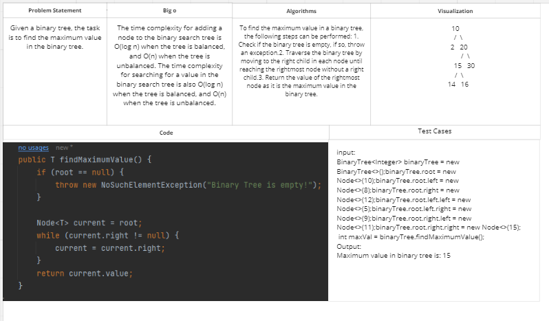
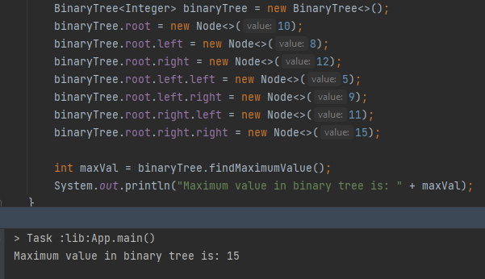
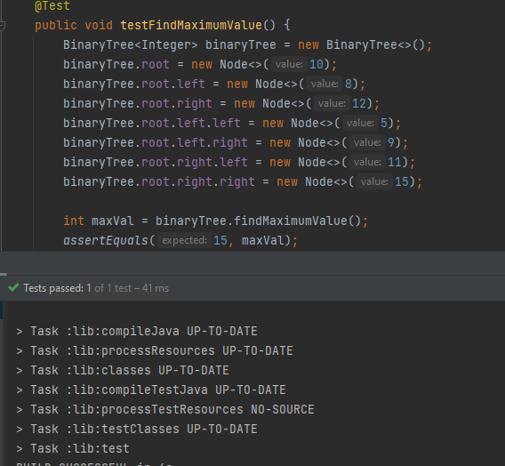

# Challenge Title: Maximum Value in a Binary Tree
<!-- Description of the challenge -->

## Whiteboard Process
<!-- Embedded whiteboard image -->

## Approach & Efficiency
<!-- What approach did you take? Why? What is the Big O space/time for this approach? -->
The approach taken to find the maximum value in the binary tree is to traverse the binary tree to its rightmost node without a right child. This is because the rightmost node of a binary tree without a right child will have the maximum value in that binary tree.

## Solution
<!-- Show how to run your code, and examples of it in action -->

