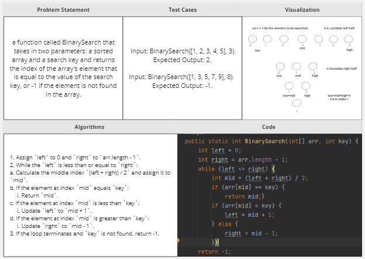

# data-structures-and-algorithms

# Challenge Title: Binary search in a sorted 1D array

<!-- Description of the challenge -->

## Whiteboard Process

## Approach & Efficiency

## Solution
<!-- Show how to run your code, and examples of it in action -->